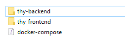

## Quick Start
1. Clone the following two repositories into the same directory
    - https://github.com/ygunduz/thy-backend.git
    - https://github.com/ygunduz/thy-frontend.git
2. Copy the docker-compose.yml file in the thy-frontend folder to the main directory
3. The folder structure should look like the following.

    
4. Open terminal in main directory
5. Launch the following command:
   ```bash
   docker compose up